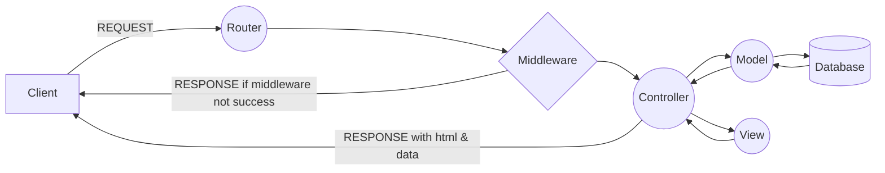

# 13-MVC

L’architecture « MVC » ( modèle vue controller).

- Model (couche data)
Partie qui gère les données du site. Il récupère les information
dite brute dans la base de données, ensuite il les organise, les
rassemble et le rend pour être traité par le controller.

- Vue (couche de présentation)
Permet l’affichage de l’interface utilisateur. Essentiellement Html
mais aussi quelques fonctions JsDOM. J’ai donc utilisé le moteur de
templating handlebars ( HBS ).

- Controller (couche logique)
Intermédiaire entre model et vue. Le controller va demander les
informations de la base de données via une requête SQL, les
analyser, prendre des décisions et rendre du texte à afficher pour
l’utilisateur.

## Info:

L’architecture MVC (Modèle, Vue et Contrôleur) est un concept très puissant qui est mis en place pendant la réalisation d’une application. Son principal intérêt est la séparation des données (modèle), de l’affichage (vue) et des actions (contrôleur). Ce concept peut très bien être appliqué à un site ou une application internet. De nombreux sites internet disposent d’une plateforme d’administration pour modifier facilement les contenus conçue selon le modèle MVC. 

[Source: + info](https://www.aurone.com/blog/architecture-mvc/)

# Pré-requis
- Install NodeJS (v14): https://github.com/nodesource/distributions/blob/master/README.md

# DOC

### Architechture MVC
https://media.discordapp.net/attachments/917846557112549376/950378341272285184/MVC-arch.png

### Promise
https://developer.mozilla.org/fr/docs/Web/JavaScript/Reference/Global_Objects/Promise
https://www.w3schools.com/js/js_promise.asp

### information
  - https://waytolearnx.com/2020/01/quest-ce-que-le-modele-mvc-et-a-quoi-ca-sert.html
