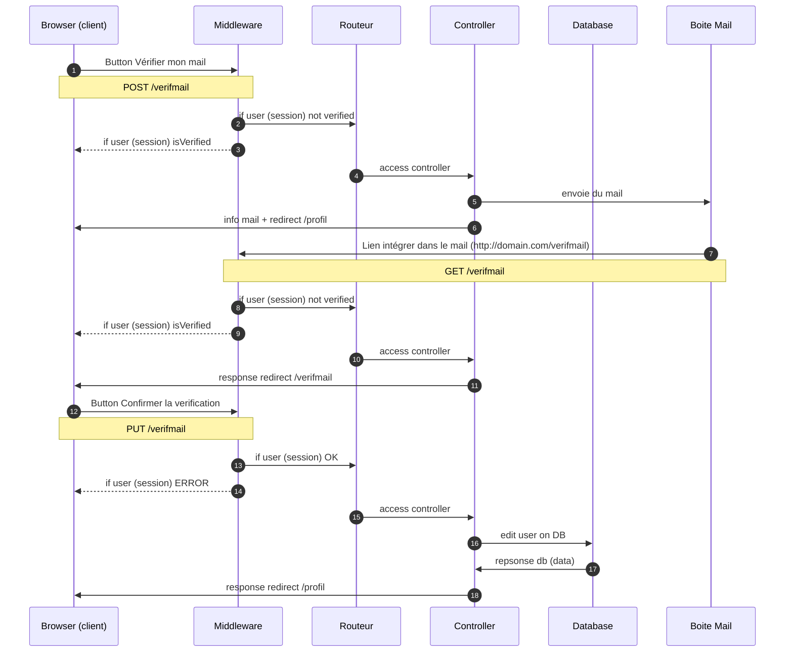
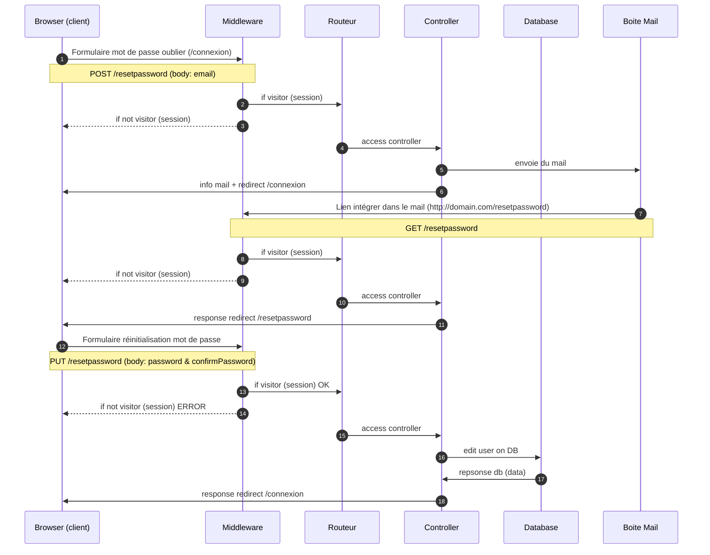

# 14-Verification de Mail & Mot de passe Oublier

Verif Mail:
  - L'objectif est de confirmez que la personne qui c'est inscrite est bien celle qui possède le mail.
  - C'est pourquoi nous allons envoyer un mail sur l'addresse fournit avec un lien lui permettant de confirmez son mail dans notre application
  - Ensuite nous allons éditer dans notre DB la valeur isVerified en true

Lost Password:
  - L'objectif est de réinitialiser le mot de passe lier au mail de l'utilisateur.
  - C'est pourquoi nous allons lui envoyer un mail sur l'address fournit avec un lien lui permettant de créé un nouveau mot de passe.
  - Ensuite nous allons editer dans notre DB la valeur du mot de passe en prennant soin de bien hasher son nouveau mot de passe.

# Info
Il y a plusieurs manières de réaliser nos fonctionalités, nous pourrions envoyer le mail de confirmation dès l'inscription du nouvelle utilisateur, mais si nous activons une limite de temps après l'inscription alors une fois la limite dépasser un boutton est utile dans la partie profile afin que la personne puisse ce connecter avec son compte non vérifié et peux le vérifié quand elle le désire.

Pour le reset password nous pourrions aussi utiliser un token du style JWT afin de limiter le temps d'action disponible a la réinitialisation du mot de passe, en cas de délai dépasser alors l'utilisateur doit refaire une nouvelle demande d'édition de son mot de passe.

## Diagram : Verification du mail

## Diagram : Mot de passe oublier

(dans visual studio code: click droit avoir un aperçu, si vous ne voyez pas le schema télécharger l'extension "markdown preview mermaid")

# Pré-requis
- Install NodeJS (v14): https://github.com/nodesource/distributions/blob/master/README.md

# DOC

### Architechture MVC
  - https://media.discordapp.net/attachments/917846557112549376/950378341272285184/MVC-arch.png

### Promise
  - https://developer.mozilla.org/fr/docs/Web/JavaScript/Reference/Global_Objects/Promise
https://www.w3schools.com/js/js_promise.asp

### information
  - https://waytolearnx.com/2020/01/quest-ce-que-le-modele-mvc-et-a-quoi-ca-sert.html
